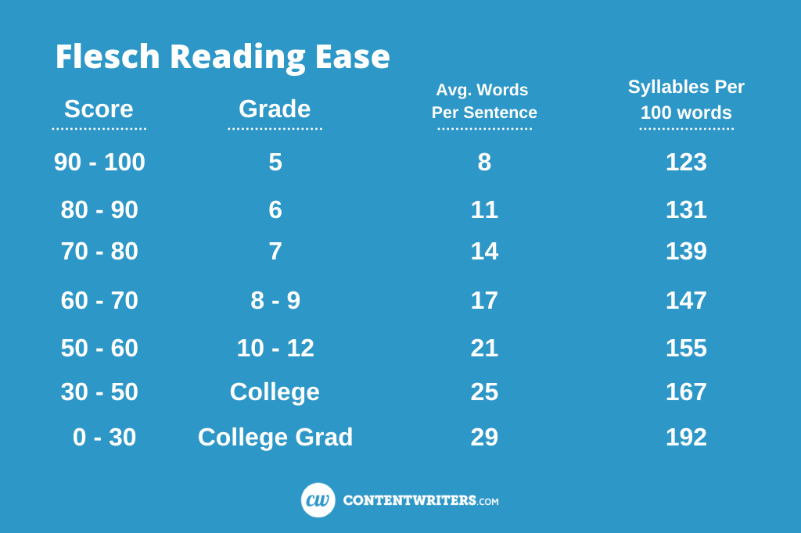

# OpenPFx
## Making medical reports understandable.
OpenPFx is an open-source program that uses generative AI to generate patient-friendly explanations (PFx) of medical findings. 

**[Visit Website](https://openpfx.streamlit.app)**

## Key Features 

### 📊 Advanced Stats:

**ICD-10 Codes**: standard medical codes used worldwide to label diseases and health conditions

> DISCLAIMER: ICD-10 codes provided by this tool are approximations for informational use and may be inaccurate. Always confirm final codes with a licensed clinician or certified medical coder.


**Readability**: The Flesch Reading Ease Score (FRES) is used to measure 
> 


**Accuracy**: measured through mutliple ICD-10 checks
> When the LLM generates a PFx, it also assigns an ICD-10 code to its own response. A separate agent then reads that PFx and assigns a code as well. The first three digits of both predictions are compared to the first three digits of the true ICD-10 code. Each correct match earns a point, and the two points are averaged.

### 📝 Pre-Generated PFx: 

On website, navigate to Browse PFx page. Select desired workflow (see workflow explanations below) and finding(s).

[Acesss Through Raw CSV Files](./Generated_PFx_CSVs/)


### 🖥️ Generate Your Own PFx:

On website, navigate to Generate page. Input finding, model, desired grade level, workflow (see explanation below), and ICD-10 Code (optional)
>ICD-10 code will be autofilled if you don't input one
>FRES + Accuracy metrics provided


## Workflows Explained
OpenPFx offers four approaches for generating explanations

[See All Prompts Here](./Generated_PFx_CSVs/)

### Zero-shot Prompting 
No context such as a template or an example letter is provided, requiring the LLM to rely solely on its previous knowledge. 

### Few-shot Prompting
Provides context such as sample responses or templates.

### Agentic 
Structured process that enables AI models, acting as "agents," to iteratively refine their outputs based on feedback and contextual adjustments.

OpenPFx uses the AG2 (formally Autogen) framework. Below is a flowchart of the original workflow used.

## 🚀 Getting Started

Follow these instructions to set up and run **OpenPFx** locally.

### Prerequisites
- Python 3.9 or higher  
- [pip](https://pip.pypa.io/en/stable/) or conda  
- An [OpenAI API key](https://platform.openai.com/)

---

### Installation

#### 🐧 Linux / 🍏 macOS

1. **Clone the repository**
```bash
git clone https://github.com/your_username/OpenPFx.git
cd OpenPFx
```

2. **Create and activate a virtual environment**
```bash
python3 -m venv .venv
source .venv/bin/activate
```

3. **Install dependencies**
```bash
pip install -r requirements.txt
```

4. **Set environment variables**  
Create a `.env` file in the project root:
```env
OPENAI_API_KEY=your_api_key_here
OPENAI_MODEL=gpt-4o
```

5. **Run the app**
```bash
streamlit run streamlit.py
```

The app will open in your browser at [http://localhost:8501](http://localhost:8501).

---

#### 🪟 Windows (PowerShell)

1. **Clone the repository**
```powershell
git clone https://github.com/your_username/OpenPFx.git
cd OpenPFx
```

2. **Create and activate a virtual environment**
```powershell
python -m venv .venv
.venv\Scripts\Activate.ps1
```

3. **Install dependencies**
```powershell
pip install -r requirements.txt
```

4. **Set environment variables**  
Create a file named `.env` in the project root with:
```env
OPENAI_API_KEY=your_api_key_here
OPENAI_MODEL=gpt-4o
```

5. **Run the app**
```powershell
streamlit run streamlit.py
```

The app will open at [http://localhost:8501](http://localhost:8501).


